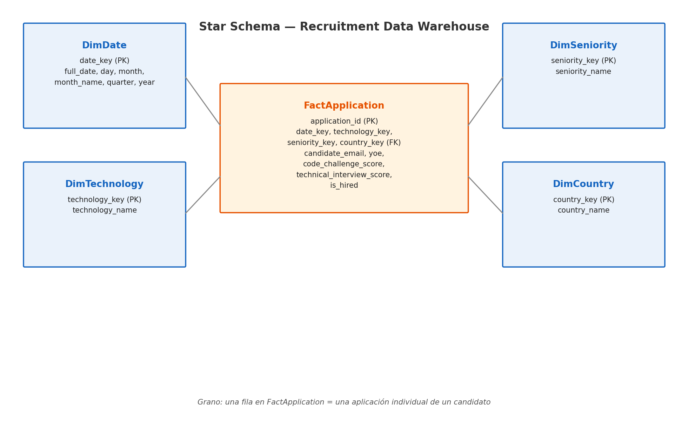
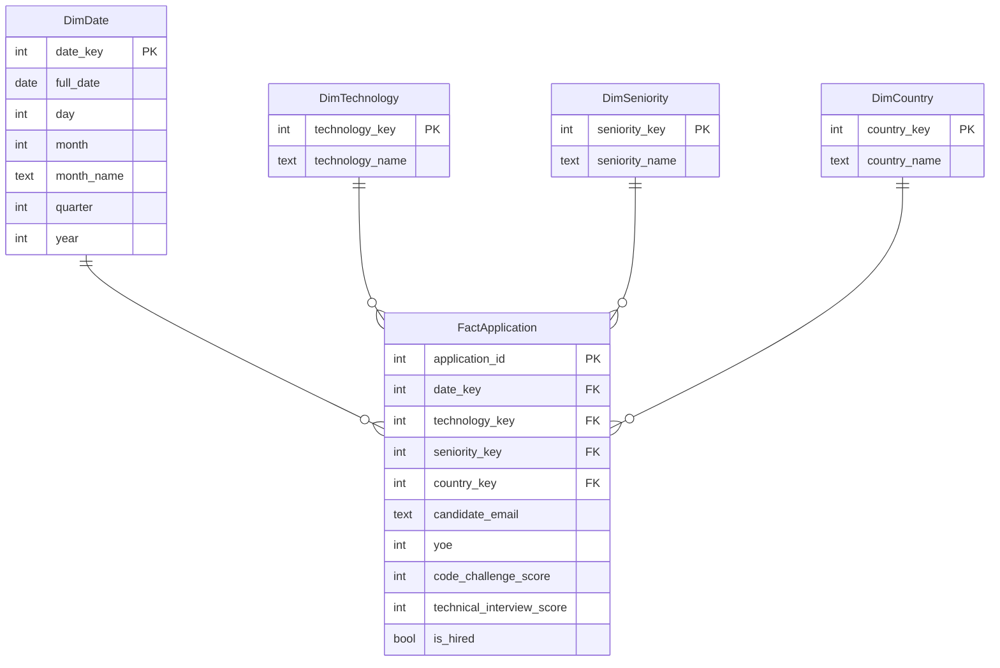
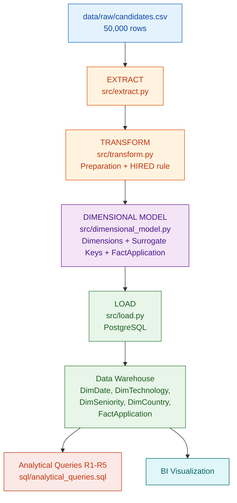
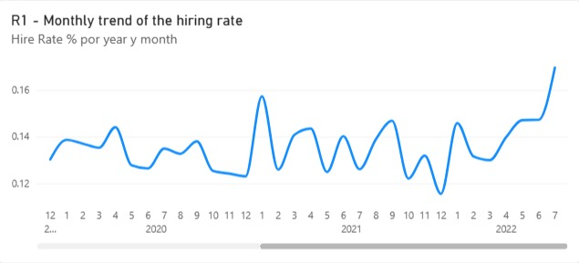
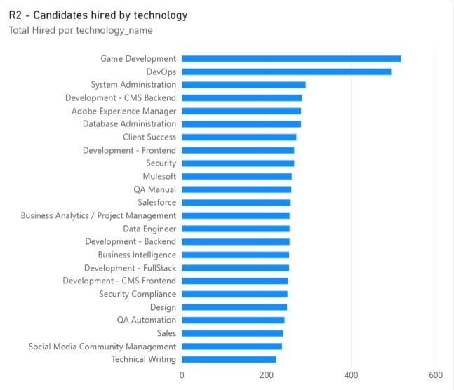
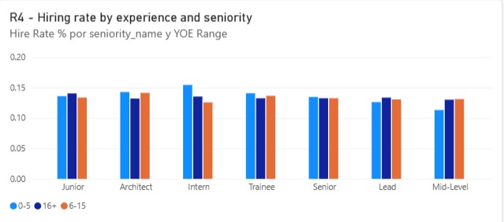

# Workshop 1 — From Business Requirements to a Dimensional Data Warehouse

> **ETL (G01)**
> Technical recruitment process: candidate applications

---

## 1. Project Objective

Design and implement a dimensional Data Warehouse that allows a tech recruitment company to analyze its candidate selection process: hiring trends over time, performance by technology, by candidate profile (seniority and experience), and by country of origin. The project covers the full flow: business requirements, data profiling, dimensional modeling, ETL, loading into a relational Data Warehouse, analytical queries, and visualization.

---

## 2. Business Context

A tech recruitment company receives thousands of candidate applications with different professional profiles, experience levels, countries of origin, and technical specialties. Each candidate is evaluated through two technical assessments: a **Code Challenge Score** and a **Technical Interview Score**. Application data is currently available as a flat file, and the organization needs an analytical system to understand hiring patterns and evaluate recruitment process performance from multiple perspectives.

---

## 3. Business Requirements

| ID | Business Requirement | Business Question | Decision Supported |
|---|---|---|---|
| **R1** | Monitor hiring trends over time. | How does the hiring rate evolve month by month? | Adjust the recruitment strategy according to periods of better or worse performance. |
| **R2** | Compare hiring outcomes across technologies. | Which technologies generate the highest number and proportion of hired candidates? | Prioritize sourcing investment in technologies with better conversion. |
| **R3** | Analyze hiring outcomes by seniority and years of experience. | How do hiring outcomes vary across candidate profiles? | Adjust the evaluation approach by seniority level. |
| **R4** | Assess whether experience (YOE) is associated with better outcomes, controlling for seniority. | Within the same seniority level, does more experience improve the outcome? | Decide whether YOE should be used as an initial candidate screening criterion. |
| **R5** | Analyze application volume and hiring rate by country. | Which countries generate the most applications, and which have the best hiring rate? | Prioritize recruitment campaigns or local partnerships by country. |

---

## 4. Requirements Traceability

| Requirement | Business Question | Data Required | Expected Analytical Output |
|---|---|---|---|
| R1 | Monthly evolution of the hiring rate | Application Date, Code Challenge Score, Technical Interview Score | Time series of applications and hiring rate by month |
| R2 | Hiring by technology | Technology, Code Challenge Score, Technical Interview Score | Ranking of technologies by volume and hiring rate |
| R3 | Hiring by seniority and experience | Seniority, YOE, Code Challenge Score, Technical Interview Score | Hiring rate and average experience by seniority level |
| R4 | Experience vs. outcome, within each seniority level | Seniority, YOE, Code Challenge Score, Technical Interview Score | Hiring rate by YOE range, segmented by seniority |
| R5 | Hiring by country | Country, Code Challenge Score, Technical Interview Score | Ranking of countries by application volume and hiring rate |

---

## 5. Dataset Description

- **Source:** `data/raw/candidates.csv` (original file, unmodified).
- **Volume:** 50,000 candidate applications, 10 columns.
- **Source file grain:** one row = one individual application.

| Column | Type | Description |
|---|---|---|
| First Name, Last Name | text | Candidate's name |
| Email | text | Candidate's email (natural identifier of the application) |
| Application Date | date | Date of the application |
| Country | text | Candidate's country |
| YOE | integer | Years of professional experience |
| Seniority | text | Seniority level (Intern, Trainee, Junior, Mid-Level, Senior, Lead, Architect) |
| Technology | text | Technical specialty of the application |
| Code Challenge Score | integer (0-10) | Code test result |
| Technical Interview Score | integer (0-10) | Technical interview result |

**Business rule:** `HIRED = (Code Challenge Score >= 7) AND (Technical Interview Score >= 7)`.

---

## 6. Key Findings from Profiling (Task 1)

Full detail in `notebooks/data_profiling.ipynb`.

- 50,000 rows, 10 columns, **no null values**.
- **0 exact duplicate rows**; **167 duplicate emails** (candidates who applied more than once). All rows are kept, since the business grain is the application, not the candidate.
- `Country`: 244 unique values. `Technology`: 24 categories. `Seniority`: 7 levels, distributed almost uniformly (~7,000 records each).
- `Application Date` covers the range **2018-01-01 to 2022-07-04**.
- `YOE`: 0 to 30 years, mean 15.3.
- `Code Challenge Score` and `Technical Interview Score`: range 0-10, means close to 5, approximately uniform distribution.
- Applying the business rule, **6,698 out of 50,000 applications (13.4%)** result in HIRED.

---

## 7. Business Process and Grain

**Business process:** evaluation of candidate applications in technical recruitment processes.

**`FactApplication` grain:** one row represents **one individual candidate application**, evaluated with two scores, on a given date, country, technology, and seniority level.

---

## 8. Star Schema





### 8.1 Dimensions

| Dimension | Purpose | Main Attributes | Requirement(s) Supported |
|---|---|---|---|
| DimDate | Analyze hiring trends over time | date_key, full_date, day, month, month_name, quarter, year | R1 |
| DimTechnology | Compare outcomes by technology profile | technology_key, technology_name | R2 |
| DimSeniority | Analyze outcomes by seniority level | seniority_key, seniority_name | R3, R4 |
| DimCountry | Analyze volume and outcomes by country | country_key, country_name | R5 |

### 8.2 Facts and Measures

| Measure | Meaning | Calculation | Requirement(s) Supported |
|---|---|---|---|
| code_challenge_score | Code test score | Source column | R1, R2, R3, R4 |
| technical_interview_score | Technical interview score | Source column | R1, R2, R3, R4 |
| yoe | Years of experience (degenerate attribute in the fact) | Source column | R4 |
| is_hired | Hiring indicator | `(code_challenge_score >= 7) AND (technical_interview_score >= 7)` | R1, R2, R3, R4, R5 |
| application_count | Application count | 1 per row (grain) | R1, R2, R3, R4, R5 |

`YOE` was kept as a numeric attribute in the fact table, instead of creating a `DimExperienceRange`, as an intentional design decision to keep the model simple: experience ranges are computed at query time (see R4 in `sql/analytical_queries.sql`).

### 8.3 Model Validation Against Requirements

| Requirement | Dimension(s) Required | Measure(s) Required | Supported |
|---|---|---|---|
| R1 | DimDate | application_count, is_hired | Yes |
| R2 | DimTechnology | application_count, is_hired | Yes |
| R3 | DimSeniority | application_count, is_hired, yoe | Yes |
| R4 | DimSeniority | yoe, is_hired | Yes |
| R5 | DimCountry | application_count, is_hired | Yes |

---

## 9. ETL Architecture



### Load Order (respecting foreign keys)

1. `DimDate` — generated from the unique dates in `Application Date` (1,646 dates).
2. `DimTechnology` — generated from the unique values of `Technology` (24 records).
3. `DimSeniority` — generated from the unique values of `Seniority` (7 records).
4. `DimCountry` — generated from the unique values of `Country` (244 records).
5. `FactApplication` — loaded last, mapping each application to its surrogate keys (50,000 records).

### Surrogate Key Strategy

- Dimension surrogate keys are auto-incrementing integers, generated in the pipeline (`dimensional_model.py`) or via `SERIAL` in PostgreSQL (`create_tables.sql`).
- `date_key` uses the standard `YYYYMMDD` integer format.
- Source natural keys (`Email`, `Technology`, `Seniority`, `Country`) are used only for mapping during load; they are not the primary key of any dimension.

---

## 10. Transformation Decisions

- **Duplicate emails (167):** all rows are kept. Each row represents a distinct application, not a unique candidate; removing duplicates would drop legitimate applications and distort R1-R5.
- **Data types:** `Application Date` is converted to a date type; scores and YOE are validated as integers.
- **No null imputation:** the initial profiling found no null values.
- **YOE as a fact attribute:** creating a `DimExperienceRange` was considered, but it was decided to keep it as a numeric attribute in `FactApplication` and compute ranges at query time, avoiding an additional low-analytical-cardinality dimension.
- **HIRED rule applied in the business transformation stage** (`transform.py`), not in extraction, following the workshop requirement of not mixing extraction with business transformation.

---

## 11. Technologies

- Python 3 / Pandas — extraction, preparation, and transformation.
- Jupyter Notebook — initial data profiling (`notebooks/data_profiling.ipynb`).
- PostgreSQL — dimensional Data Warehouse.
- SQLAlchemy + psycopg2 — data loading from Python into PostgreSQL.
- SQL — analytical queries (`sql/analytical_queries.sql`).
- Git / GitHub — version control.
- Power BI — final visualization (Task 7).

---

## 12. How to Run the Project

### 12.1 Prerequisites

- Python 3.10 or higher.
- PostgreSQL running (local or remote).
- An empty database already created (e.g. `recruitment_dw`).

### 12.2 Installation

```bash
python -m venv venv
source venv/bin/activate        # On Windows: venv\Scripts\activate
pip install -r requirements.txt
```

### 12.3 Configure the PostgreSQL connection

```bash
cp .env.example .env
# Edit .env with your local credentials: DB_HOST, DB_PORT, DB_NAME, DB_USER, DB_PASSWORD
```

### 12.4 Run the full pipeline

```bash
python src/main.py
```

This command runs, in order: extraction, transformation, dimensional modeling, PostgreSQL schema creation, dimension and fact loading, and load validation (record counts and absence of invalid references).

### 12.5 Run the profiling notebook

```bash
jupyter lab notebooks/data_profiling.ipynb
```

### 12.6 Run the analytical queries

```bash
psql -U <user> -d recruitment_dw -f sql/analytical_queries.sql
```

---

## 13. Analytical Queries and KPIs (Task 6)

All results were generated by executing `sql/analytical_queries.sql` against the Data Warehouse.

### R1 — Hiring Trend (sample: first 3 months)

| Year | Month | Applications | Hired | Hiring Rate |
|---|---|---|---|---|
| 2018 | January | 922 | 112 | 12.15% |
| 2018 | February | 867 | 123 | 14.19% |
| 2018 | March | 899 | 116 | 12.90% |

**Interpretation:** the monthly hiring rate oscillates between 12% and 14%, with no sustained growth or decline trend over the period. This indicates that, based on current data, the hiring outcome is relatively stable month over month.

### R2 — Hiring by Technology (top 5 by hired candidates)

| Technology | Applications | Hired | Hiring Rate |
|---|---|---|---|
| Game Development | 3,818 | 519 | 13.59% |
| DevOps | 3,808 | 495 | 13.00% |
| System Administration | 2,014 | 293 | 14.55% |
| Development - CMS Backend | 1,882 | 284 | 15.09% |
| Database Administration | 1,933 | 282 | 14.59% |

**Interpretation:** technologies with the highest application volume (Game Development, DevOps) do not necessarily have the best hiring rate; lower-volume technologies such as Development - CMS Backend show slightly higher rates.

### R3 — Hiring by Seniority

| Seniority | Avg. YOE | Applications | Hired | Hiring Rate |
|---|---|---|---|---|
| Junior | 15.3 | 7,100 | 977 | 13.76% |
| Architect | 15.3 | 7,079 | 971 | 13.72% |
| Intern | 15.4 | 7,255 | 985 | 13.58% |
| Trainee | 15.2 | 7,183 | 973 | 13.55% |
| Senior | 15.2 | 7,059 | 939 | 13.30% |
| Lead | 15.4 | 7,071 | 929 | 13.14% |
| Mid-Level | 15.2 | 7,253 | 924 | 12.74% |

**Interpretation:** the hiring rate is practically uniform across seniority levels (12.7% - 13.8%), and the average YOE is nearly identical across all levels (~15 years). This suggests that, in this dataset, `Seniority` is not correlated with better evaluation outcomes.

### R4 — Experience (YOE) vs. Outcome, by Seniority (sample: Architect)

| Seniority | YOE Range | Applications | Hired | Hiring Rate |
|---|---|---|---|---|
| Architect | 0-5 years | 1,260 | 180 | 14.29% |
| Architect | 6-15 years | 2,346 | 332 | 14.15% |
| Architect | 16+ years | 3,473 | 459 | 13.22% |

**Interpretation:** within the same seniority level, the hiring rate does not consistently improve with more years of experience; the pattern repeats across the other seniority levels (see the full table generated by the query). This indicates that, with the current data, **YOE is not a reliable predictor of the hiring outcome**.

### R5 — Hiring by Country (top 5 by volume, countries with ≥ 50 applications)

| Country | Applications | Hired | Hiring Rate |
|---|---|---|---|
| Malawi | 242 | 23 | 9.50% |
| Spain | 238 | 31 | 13.03% |
| Svalbard & Jan Mayen Islands | 234 | 26 | 11.11% |
| Netherlands Antilles | 234 | 29 | 12.39% |
| Cook Islands | 234 | 28 | 11.97% |

**Interpretation:** application volume is very similar across countries (a dataset with a broad, relatively uniform geographic distribution across 244 countries), and hiring rates vary moderately (9.5% to 15%) without any single country concentrating a dominant share.

---

## 14. BI Visualization and Interpretation (Task 7)

**BI Tool:** Power BI, connected in Import mode directly to the Data Warehouse in PostgreSQL (not to the source CSV or intermediate DataFrames), following these steps:

1. Install the Npgsql driver on the machine running Power BI Desktop (not required for Power BI Desktop versions from December 2019 onward, which include it natively).
2. Get Data → Database → PostgreSQL database, using the host/port/database name defined in `.env`.
3. Load the 5 tables (`dimdate`, `dimtechnology`, `dimseniority`, `dimcountry`, `factapplication`) and validate the relationships via the `*_key` columns.
4. Create the DAX measures: `Total Applications`, `Total Hired`, and `Hire Rate %`.

The images below (`docs/r1_temporal.png`, `docs/r2_comparativo.png`, `docs/r4_experiencia.png`) are real screenshots taken from Power BI Desktop, connected in Import mode directly to the Data Warehouse in PostgreSQL (`recruitment_dw`).

### Visualization 1 — Monthly Hiring Trend (Temporal, R1)



- **Business requirement:** R1 — Monitor hiring trends over time.
- **Business question:** How does the hiring rate evolve month by month?
- **KPI represented:** Monthly hiring rate (`Hire Rate %`).
- **Interpretation:** the monthly rate oscillates between 11.5% and 17% across the full period shown (December 2019 to July 2022), with no sustained growth or decline trend; the value moves in short cycles, with a notable peak in July 2022 (~17%). The organization can conclude that the hiring process has remained relatively stable over time.

### Visualization 2 — Candidates Hired by Technology (Comparative, R2)



- **Business requirement:** R2 — Compare hiring outcomes across technologies.
- **Business question:** Which technologies generate the highest number and proportion of hired candidates?
- **KPI represented:** Total candidates hired by technology (`Total Hired`).
- **Interpretation:** Game Development and DevOps account for the highest absolute number of hires, but this is consistent with them also receiving the highest application volume; the conversion rate (see the R2 table in Section 13) is similar across all technologies. The business decision should not rely on absolute count alone, but on the hiring rate per technology.

### Visualization 3 — Hiring Rate by Experience and Seniority (R4)



- **Business requirement:** R4 — Assess whether experience (YOE) is associated with better outcomes, controlling for seniority.
- **Business question:** Within the same seniority level, does more years of experience improve the hiring outcome?
- **KPI represented:** Hiring rate by YOE range (0-5, 6-15, 16+), segmented by seniority.
- **Interpretation:** within each seniority level, the three bars (experience ranges 0-5, 6-15, and 16+ years) are nearly identical, all between 12% and 16% hiring rate, with no experience range consistently outperforming the others. This confirms the finding from Section 13 (R4): **YOE is not a reliable predictor of the hiring outcome** in this dataset, suggesting its use as a pre-screening filter should be reconsidered.

---

## 15. Key Business Findings

- The overall hiring rate is **13.4%**, and it remains relatively stable over time, by technology, by seniority, and by country, with no marked variation.
- **Seniority and YOE show no clear association with the hiring outcome** (R3, R4): candidates with more experience or higher declared seniority do not systematically achieve better hiring rates. This suggests that the technical evaluation process (scores) is, in practice, independent of these declarative attributes.
- **No single technology or country concentrates a disproportionate share of applications**, indicating a diversified candidate base.
- Since the hiring process appears to function consistently (with no evident bias by seniority, experience, or country), one business recommendation is to focus improvement efforts on **application volume by technology** (R2) rather than on profile filters such as YOE or seniority.

---

## 16. Final Requirements Validation (Task 8)

| Requirement | Implemented | DW Tables Used | Query / KPI | Main Finding |
|---|---|---|---|---|
| R1 | Yes | FactApplication, DimDate | Query R1 | Stable monthly hiring rate (~12-14%), no sustained trend. |
| R2 | Yes | FactApplication, DimTechnology | Query R2 | High volume does not imply a better hiring rate by technology. |
| R3 | Yes | FactApplication, DimSeniority | Query R3 | Hiring rate nearly uniform across seniority levels. |
| R4 | Yes | FactApplication, DimSeniority | Query R4 | YOE does not predict better outcomes within the same seniority level. |
| R5 | Yes | FactApplication, DimCountry | Query R5 | Broad geographic distribution, no dominant country; hiring rates between 9.5% and 15%. |

**Does the final Data Warehouse provide enough information to satisfy all five requirements?** Yes. Each requirement has at least one dimension, one measure, and one analytical query directly associated with it, executed against the Data Warehouse (not against the source file).

**Does the dimensional model contain elements not justified by the analytical requirements?** No. Each dimension (`DimDate`, `DimTechnology`, `DimSeniority`, `DimCountry`) and each measure (`code_challenge_score`, `technical_interview_score`, `yoe`, `is_hired`, `application_count`) is explicitly tied to at least one business requirement (see Section 8).

**What business decisions can now be supported?** Prioritizing sourcing investment in technologies with better conversion (R2), evaluating whether to drop YOE and seniority as hard pre-screening filters given they do not predict the outcome (R3, R4), and deciding which countries to reinforce recruitment presence in based on volume and hiring rate (R5).

---

## 17. Repository Structure

```
workshop-1/
├── data/
│   └── raw/
│       └── candidates.csv
├── database/
│   └── recruitment_dw.db (reference; the actual DW lives in PostgreSQL)
├── diagrams/
│   └── star_schema.png
├── docs/
│   ├── r1_temporal.png
│   ├── r2_comparativo.png
│   └── r4_experiencia.png
├── notebooks/
│   └── data_profiling.ipynb
├── sql/
│   ├── create_tables.sql
│   └── analytical_queries.sql
├── src/
│   ├── extract.py
│   ├── transform.py
│   ├── dimensional_model.py
│   ├── load.py
│   └── main.py
├── .env.example
├── .gitignore
├── README.md
└── requirements.txt
```

---

## Author

Samuel Izquierdo Bonilla
